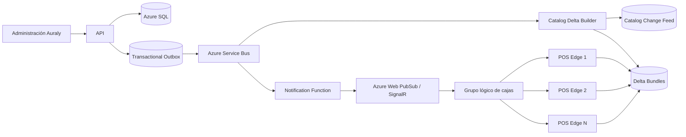

# Arquitectura push para actualizar productos y precios en las cajas

**Estado:** decisión de arquitectura para el MVP  
**Fecha:** 23 de julio de 2026  
**Objetivo:** propagar cambios puntuales a muchas cajas sin polling constante ni pérdida de actualizaciones.

---

## 1. Decisión

Se usará un modelo híbrido:

```text
Push de notificación
        +
Change feed recuperable
        +
Descarga de deltas versionados
```

No se usará:

- una consulta de cada caja cada pocos segundos;
- una conexión directa de cada caja a Azure SQL;
- un mensaje con todo el producto enviado individualmente a cada dispositivo;
- push como único mecanismo de consistencia.

Push avisa que hay cambios. El change feed garantiza que puedan recuperarse. Los deltas contienen los datos.

---

## 2. Por qué no usar solamente polling

Con muchos clientes y cajas, un polling cada pocos segundos produce:

```text
clientes × cajas × consultas por minuto
```

La mayoría de respuestas dirían “no hay cambios”.

Ejemplo:

```text
1.000 negocios
10 cajas por negocio
polling cada 10 segundos
= 60.000 consultas por minuto
```

Eso consume:

- conexiones;
- CPU;
- Azure SQL;
- API;
- red;
- batería y recursos locales;
- observabilidad.

Además, una frecuencia baja tarda demasiado y una frecuencia alta escala mal.

---

## 3. Por qué no usar solamente push

Una notificación puede perderse porque:

- la caja estaba apagada;
- no tenía internet;
- el WebSocket se reconectó;
- el proceso local reinició;
- el mensaje expiró;
- hubo un despliegue;
- la caja recibió el aviso pero falló antes de guardar.

Por eso el mensaje push no representa la verdad. Solo dice:

```text
“Tu revisión local está atrasada; sincroniza desde este punto”.
```

La verdad está en un change feed durable y ordenado.

---

## 4. Componentes



### Backend

- Azure SQL: producto y transacción.
- Transactional Outbox: evento garantizado junto con el cambio.
- Service Bus: comunicación interna entre servicios.
- Azure Function: agrupa cambios y publica avisos.
- Azure Web PubSub o Azure SignalR Service: conexiones con cajas.
- Blob Storage/CDN: paquetes comprimidos reutilizables.
- Redis opcional: manifiestos y deltas pequeños calientes.

### Caja

- POS Edge mantiene WebSocket;
- SQLite conserva catálogo y checkpoint;
- sincronizador descarga y aplica;
- PWA recibe el estado desde POS Edge.

Service Bus no tendrá una suscripción por cada caja. Se usa internamente. El fan-out a dispositivos se realiza mediante grupos de un servicio administrado de conexiones.

---

## 5. Flujo de un cambio

Ejemplo: cambiar descripción, código y precio de dos productos.

### Paso 1: transacción

La API guarda en una misma transacción:

- productos;
- códigos/precios;
- revisión;
- registro de outbox.

### Paso 2: evento interno

Outbox publica:

```json
{
  "eventType": "CatalogEntitiesChanged",
  "tenantId": "...",
  "businessId": "...",
  "entityType": "Product",
  "entityIds": ["p1", "p2"],
  "revision": 1843
}
```

### Paso 3: construir delta

El constructor:

- determina cajas/listas/bodegas afectadas;
- reúne cambios cercanos;
- genera un paquete;
- comprime;
- calcula hash;
- firma manifiesto;
- registra rango de revisiones.

### Paso 4: notificar una vez por grupo

```json
{
  "type": "CatalogUpdateAvailable",
  "scope": "business:123",
  "fromRevision": 1842,
  "toRevision": 1843,
  "bundleId": "catalog-123-1843",
  "urgency": "normal"
}
```

El backend publica una vez al grupo. El servicio administrado distribuye a las conexiones.

### Paso 5: caja

POS Edge:

1. recibe aviso;
2. compara revisión;
3. espera brevemente para agrupar avisos;
4. descarga el delta;
5. valida tenant, scope, firma y hash;
6. inicia transacción SQLite;
7. actualiza productos, códigos, precios e índices;
8. guarda checkpoint;
9. confirma estado al portal.

La caja no descarga todo el catálogo.

---

## 6. Grupos de difusión

No todos los cambios afectan a todas las cajas.

Grupos:

```text
tenant:{tenantId}
business:{businessId}
branch:{branchId}
warehouse:{warehouseId}
price-list:{priceListId}
cash-register:{cashRegisterId}
device:{deviceId}
```

Ejemplos:

| Cambio | Grupo |
|---|---|
| Nombre general de producto | negocio |
| Código de barras | negocio |
| Precio de lista | lista de precios |
| Producto habilitado en bodega | bodega |
| Configuración de caja | caja |
| Revocar dispositivo | dispositivo |
| Impuesto general | negocio/perfil fiscal |
| Política de negativos | caja |

Una caja se une solamente a grupos autorizados según su configuración.

---

## 7. Revisiones y change feed

Cada ámbito mantiene revisión monotónica.

```text
CatalogRevision
PricingRevision
TaxRevision
WarehouseCatalogRevision
CashRegisterConfigRevision
```

Ejemplo local:

```text
CatalogRevision = 1842
PricingRevision = 932
TaxRevision = 71
```

El aviso indica que catálogo llegó a 1843. La caja solicita:

```text
changes after 1842
```

### Si perdió varios avisos

Recibe un delta acumulado:

```text
1843 ... 1857
```

### Si estuvo demasiado tiempo desconectada

Cuando el feed ya expiró:

- descarga snapshot nuevo;
- conserva outbox;
- reemplaza catálogo atómicamente;
- continúa.

Retención sugerida del feed: entre 7 y 30 días, ajustada al volumen.

---

## 8. Paquetes compartidos

Si cien cajas usan el mismo catálogo, no se generan cien paquetes.

Se genera:

```text
un delta por ámbito y revisión
```

Las cajas descargan el mismo archivo versionado desde Blob/CDN.

Ventajas:

- menos CPU del API;
- menos consultas a SQL;
- cache de CDN;
- reintentos baratos;
- hashes reproducibles;
- descarga reanudable.

Un delta pequeño también puede responder desde Redis/API, pero conserva el mismo contrato.

---

## 9. Agrupación de cambios

Importar mil precios no debe producir mil notificaciones.

Se usa una ventana de coalescencia:

```text
250 ms a 2 s
```

Se agrupan por:

- tenant;
- negocio;
- scope;
- tipo;
- revisión.

Resultado:

```text
ProductsChanged [p1, p2, ... p1000]
PricingRevision 933
```

La interfaz administrativa puede guardar en lote y generar una única actualización.

---

## 10. Qué ocurre durante una venta

Una actualización no debe cambiar una línea que el cajero ya mostró al cliente.

### Nuevos escaneos

Usan la revisión recién aplicada.

### Líneas existentes

Conservan:

- producto;
- descripción;
- precio;
- impuesto;
- descuento;
- versión.

Si el cambio es crítico, la interfaz muestra:

```text
“Hay cambios de precio en 2 líneas. Revisar antes de cobrar”.
```

Nunca repricia silenciosamente.

### Venta guardada

Al recuperarla compara versiones y permite:

- conservar;
- actualizar;
- revisar diferencias.

---

## 11. Cambios urgentes

Algunos cambios requieren prioridad:

- producto retirado;
- código incorrecto;
- precio crítico;
- impuesto;
- dispositivo revocado;
- resolución fiscal;
- certificado;
- caja bloqueada.

El evento incluye:

```text
urgency = normal | high | blocking
effectiveAt
```

### `normal`

Se aplica en segundo plano.

### `high`

Se descarga inmediatamente y muestra aviso.

### `blocking`

Impide iniciar una nueva venta hasta aplicar el cambio. No interrumpe destructivamente una venta ya cobrada.

Los cambios fiscales críticos no deben esperar una sincronización nocturna.

---

## 12. Inventario no es catálogo

No se debe emitir una actualización de producto a todas las cajas por cada venta.

Se separan:

### Catálogo y precios

- baja frecuencia;
- consistencia fuerte de versión;
- push inmediato;
- delta durable.

### Existencias

- alta frecuencia;
- valor informativo en POS;
- agregación;
- actualización periódica o por lotes;
- scope por bodega;
- saldos locales ajustados con ventas pendientes.

Propuesta para inventario:

- el servidor agrupa cambios durante algunos segundos;
- envía revisión de saldos por bodega;
- la caja descarga solo productos modificados;
- no se difunde movimiento por movimiento a cada caja.

Como la venta negativa depende de la configuración de caja, una pequeña demora del saldo informativo no detiene una caja habilitada para negativos.

---

## 13. Reconexión y garantía

Al conectarse:

1. autenticar dispositivo;
2. unirse a grupos;
3. reportar checkpoints;
4. consultar manifiesto una vez;
5. recuperar revisiones faltantes;
6. iniciar escucha push.

Aunque no haya recibido ningún aviso, la comparación de checkpoints detecta atrasos.

Además se hace una reconciliación de seguridad poco frecuente:

- al abrir turno;
- al recuperar conexión;
- cada cierto número de minutos con `ETag`;
- antes de procesos fiscales críticos.

Esto no es polling agresivo. Una respuesta `304/Not Modified` es barata y protege contra fallos prolongados del canal push.

---

## 14. Escalabilidad multi-tenant

### Aislamiento

- cada evento incluye tenant;
- los grupos se autorizan desde el backend;
- una caja no decide a qué tenant unirse;
- URLs de delta son temporales y limitadas al scope;
- el paquete se valida antes de aplicar.

### Partición

Partición lógica sugerida:

```text
TenantId + BusinessId + ScopeType + ScopeId
```

Negocios grandes pueden subdividirse por:

- región;
- lista;
- bodega;
- familia de productos.

No se debe particionar por producto desde el principio; produciría demasiados grupos.

### Protección

- límites por tenant;
- backpressure;
- lotes;
- reintento con jitter;
- circuit breaker;
- cuotas de descarga;
- CDN;
- métricas por scope.

Si miles de cajas se reconectan a la vez, cada una espera un jitter aleatorio antes de descargar para evitar estampida.

---

## 15. Confirmación y observabilidad

Cada caja reporta:

- revisión aplicada;
- hora;
- duración;
- elementos modificados;
- hash;
- error;
- espacio local.

El portal puede mostrar:

| Caja | Catálogo central | Catálogo local | Estado |
|---|---:|---:|---|
| Caja 1 | 1857 | 1857 | Actualizada |
| Caja 2 | 1857 | 1854 | Pendiente |
| Caja 3 | 1857 | 1801 | Offline |

No se requiere ACK de cada evento push. Se reporta el checkpoint efectivo, que es más fiable.

Alertas:

- caja atrasada;
- delta fallido;
- demasiados reintentos;
- snapshot requerido;
- hash inválido;
- conexión revocada;
- versión incompatible.

---

## 16. Contratos sugeridos

### Notificación

```json
{
  "messageId": "uuid",
  "type": "CatalogUpdateAvailable",
  "tenantId": "uuid",
  "scopeType": "Business",
  "scopeId": "uuid",
  "fromRevision": 1842,
  "toRevision": 1847,
  "bundleId": "bundle-id",
  "urgency": "normal",
  "effectiveAt": "2026-07-23T15:20:00Z"
}
```

### Manifiesto

```json
{
  "scope": "business:uuid",
  "currentRevision": 1847,
  "minimumDeltaRevision": 1720,
  "schemaVersion": 3,
  "pricingRevision": 933,
  "taxRevision": 71
}
```

### Resultado local

```json
{
  "deviceId": "uuid",
  "scope": "business:uuid",
  "appliedRevision": 1847,
  "appliedAt": "2026-07-23T15:20:02Z",
  "status": "Applied",
  "changedEntities": 12
}
```

---

## 17. Tecnología recomendada en Azure

### Plano de eventos interno

- Transactional Outbox;
- Azure Service Bus Topic;
- Azure Functions.

### Conexiones de cajas

Opción recomendada:

- Azure Web PubSub para grupos y conexiones WebSocket.

Alternativa válida:

- Azure SignalR Service si se prefiere integración directa con hubs .NET.

La elección se valida con una prueba técnica, pero el contrato funcional no depende del proveedor.

### Datos

- Azure SQL para change feed y checkpoints;
- Blob Storage para paquetes;
- Azure CDN/Front Door para distribución;
- Redis opcional para manifiestos/deltas calientes.

---

## 18. Pruebas necesarias

- un producto cambia y cien cajas reciben un solo evento de grupo;
- una caja aplica únicamente ese producto;
- importación masiva produce un lote;
- caja offline pierde diez eventos y recupera todos;
- delta expirado fuerza snapshot;
- mensaje duplicado no reaplica;
- delta fuera de orden no corrompe revisión;
- precio cambia durante una venta y no modifica líneas existentes;
- producto se desactiva con urgencia;
- caja de otro tenant no recibe ni descarga;
- diez mil reconexiones usan jitter;
- caída de WebSocket se recupera;
- Blob/CDN evita consultas repetidas a SQL;
- inventario se agrega por bodega, no por cada movimiento.

---

## 19. Conclusión

La arquitectura recomendada es:

```text
El servidor publica una vez
        ↓
las cajas afectadas reciben un aviso
        ↓
cada caja descarga solo el delta faltante
        ↓
el checkpoint garantiza recuperación
```

Esto ofrece:

- actualización casi inmediata;
- pocas consultas inútiles;
- recuperación después de estar offline;
- escalabilidad multi-tenant;
- catálogo local rápido;
- precios versionados;
- control operativo visible.

El principio más importante es separar:

```text
notificación ≠ dato ≠ garantía
```

La notificación despierta, el delta actualiza y el checkpoint garantiza.
