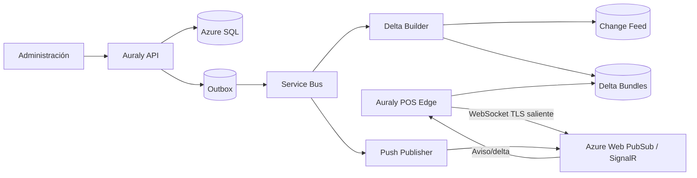

# Decisión: canal push del servidor hacia las cajas

**Estado:** decisión vigente  
**Fecha:** 23 de julio de 2026  
**Prioridad:** ajusta la propuesta anterior que descartaba SignalR/WebSocket en el MVP.

---

## 1. Respuesta corta

Sí conviene que Auraly envíe los cambios a las cajas.

Sin embargo, la conexión no puede abrirse normalmente desde Azure hacia el computador de la caja porque este se encuentra detrás de:

- NAT;
- router;
- firewall;
- IP dinámica;
- red corporativa;
- proveedor de internet.

La forma correcta es:

```text
POS Edge abre una conexión saliente segura
              ↓
Azure conserva el canal
              ↓
El servidor envía cambios por ese canal
```

Desde el punto de vista funcional, el servidor está conectado con la caja. Técnicamente, la caja inició la conexión.

---

## 2. Arquitectura definitiva

Se usará:

```text
Push por conexión persistente
        +
Change feed durable
        +
Checkpoint local
        +
Snapshot de recuperación
```



Push evita polling continuo. El change feed recupera mensajes perdidos.

---

## 3. Una conexión, no varias

Cada caja física tendrá:

```text
1 conexión de POS Edge
```

No tendrán conexión independiente:

- cada pestaña;
- cada navegador;
- la PWA;
- el lector;
- la balanza;
- la impresora.

La PWA se comunica con Edge por `localhost`. Edge mantiene el único canal con Azure.

---

## 4. Cuándo permanece conectada

### Turno abierto

- conexión activa;
- recibe cambios inmediatamente;
- reporta checkpoint;
- sube ventas.

### Sin turno

Opciones configurables:

- mantener conexión con baja actividad;
- desconectar después de un periodo;
- conectarse al abrir turno y recuperar cambios.

### Aplicación cerrada

Si POS Edge es servicio de Windows, puede permanecer conectado aunque la ventana esté cerrada. Para controlar costos, Auraly puede desconectarlo cuando la caja no está habilitada o activa.

---

## 5. Grupos

No se envía un mensaje individual desde la aplicación a cada caja.

POS Edge se une a grupos autorizados:

```text
business:{businessId}
price-list:{priceListId}
cash-register:{cashRegisterId}
device:{deviceId}
```

Ejemplos:

| Cambio | Destino |
|---|---|
| Producto | grupo del negocio |
| Precio | grupo de lista de precios |
| Impuesto | negocio/perfil |
| Configuración | caja |
| Balanza | caja o grupo de cajas |
| Revocación | dispositivo |

El backend publica una vez por grupo. El servicio de conexiones hace el fan-out.

---

## 6. Qué se envía

### Cambios pequeños

Se puede enviar el delta inline:

```json
{
  "type": "CatalogDelta",
  "scope": "business:123",
  "fromRevision": 1847,
  "toRevision": 1848,
  "products": [
    {
      "id": "p1",
      "name": "Nuevo nombre",
      "active": true,
      "version": 19
    }
  ]
}
```

### Cambios medianos o grandes

Se envía referencia:

```json
{
  "type": "CatalogDeltaAvailable",
  "scope": "business:123",
  "fromRevision": 1848,
  "toRevision": 1853,
  "bundleId": "bundle-1853",
  "hash": "..."
}
```

La caja descarga el paquete desde Blob/Front Door.

### Umbral

Regla sugerida:

- pocos productos y payload pequeño: inline;
- importación, precios masivos o payload grande: bundle.

El contrato admite ambos sin cambiar el sincronizador.

---

## 7. Por qué no enviar siempre todo por WebSocket

Enviar el catálogo completo por el canal:

- duplica datos para cada conexión;
- aumenta tamaño de mensajes;
- dificulta reanudación;
- complica cache;
- mezcla notificación y almacenamiento;
- exige retener mensajes grandes.

El canal es excelente para avisar y para deltas pequeños. Blob/CDN es mejor para archivos compartidos y reanudables.

---

## 8. Precios

Al cambiar un precio:

1. se confirma transacción;
2. se genera revisión;
3. outbox publica;
4. se construye delta;
5. se envía al grupo de la lista;
6. Edge aplica en SQLite;
7. nuevos escaneos usan el nuevo precio.

Líneas ya presentes:

- no se reprician silenciosamente;
- muestran aviso;
- el cajero decide actualizar según política.

El cambio puede propagarse en segundos sin consultar constantemente.

---

## 9. Producto

Se envían cambios de:

- nombre;
- descripción;
- códigos;
- referencia;
- unidad;
- empaque;
- activo/inactivo;
- impuestos;
- producto por peso;
- patrón de balanza;
- configuración comercial.

No se envía inventario.

---

## 10. Conexión perdida

El push no es garantía suficiente.

Cada caja conserva:

```text
CatalogRevision
PricingRevision
TaxRevision
CashConfigRevision
ScaleConfigRevision
```

Al reconectar envía sus revisiones.

El servidor responde:

- estás actualizado;
- descarga deltas faltantes;
- descarga snapshot porque el feed expiró.

Así una caja apagada durante una semana recibe todo al volver.

---

## 11. Mensajes duplicados y fuera de orden

Una caja puede recibir:

```text
1848
1848 otra vez
1850 antes de 1849
```

Reglas:

- revisión igual o menor: ignorar;
- revisión consecutiva: aplicar;
- salto: solicitar rango faltante;
- hash inválido: rechazar;
- aplicación transaccional;
- checkpoint después de commit.

Los eventos son idempotentes.

---

## 12. Escalabilidad

Una conexión persistente consume recursos, pero elimina gran cantidad de consultas sin cambios.

El diseño reduce carga mediante:

- una conexión por caja;
- servicio administrado de conexiones;
- grupos;
- mensajes pequeños;
- bundles compartidos;
- Blob/CDN;
- sin inventario;
- sin polling frecuente;
- reconexión con backoff;
- jitter;
- desconexión de cajas inactivas;
- partición por negocio/lista.

No se crea:

- hilo dedicado por caja en la API;
- socket administrado directamente por el Web API;
- suscripción de Service Bus por caja;
- consulta SQL por conexión.

El gateway mantiene sockets. La API publica eventos.

---

## 13. Web PubSub o SignalR

### Azure Web PubSub

Adecuado cuando:

- el protocolo es principalmente mensajes;
- Edge es un cliente no navegador;
- se desean grupos y WebSocket administrado;
- se quiere menos acoplamiento a hubs.

### Azure SignalR Service

Adecuado cuando:

- se prefiere modelo Hub de .NET;
- hay llamadas y contratos bidireccionales;
- el equipo ya domina SignalR.

Para POS Edge, la preferencia arquitectónica es Azure Web PubSub por ser un canal de mensajes simple. Debe validarse con una prueba de carga y costos antes de cerrar proveedor.

La arquitectura de revisiones no depende de cuál se elija.

---

## 14. Seguridad

1. Edge autentica dispositivo.
2. API emite token corto.
3. El token autoriza grupos concretos.
4. La caja no elige libremente tenant o negocio.
5. El canal usa TLS.
6. Cada delta incluye tenant, scope, revisión y hash.
7. Edge valida antes de guardar.
8. Revocar dispositivo cierra conexión y bloquea reconexión.

No se abren puertos entrantes en el negocio.

---

## 15. Estado visible

POS:

```text
Conectado a Auraly
Catálogo 1848
Precios 934
Sincronizado hace 4 s
```

Problema:

```text
Reconectando
Últimos precios recibidos hace 2 h
3 operaciones pendientes
```

Portal:

- cajas conectadas;
- turno;
- revisión;
- última actividad;
- mensajes pendientes;
- reconexiones;
- errores;
- versión de Edge.

---

## 16. Reintentos

Edge usa:

- reconexión exponencial;
- jitter;
- máximo configurable;
- detección de internet;
- renovación de token;
- recuperación de checkpoint.

Ejemplo:

```text
1 s, 2 s, 5 s, 10 s, 30 s, 60 s
```

Miles de cajas no deben reconectarse en el mismo instante después de una caída regional.

---

## 17. Inventario

El canal no transmite:

- existencias;
- movimientos;
- kardex;
- saldos.

Una caja que bloquea negativos consulta inventario online al capturar o modificar la línea. Es una petición específica, no sincronización.

Una caja que permite negativos no consulta inventario.

---

## 18. Fallo del canal push

Si Web PubSub/SignalR falla:

- la caja sigue vendiendo con catálogo local;
- las ventas se guardan;
- al recuperar el canal se sincronizan;
- Edge puede consultar manifiesto al reconectar;
- precios muestran antigüedad;
- no se pierde cambio porque existe change feed.

El canal mejora la inmediatez, pero no es un punto único de verdad.

---

## 19. Prueba técnica antes de producción

Se debe simular:

- muchas conexiones concurrentes;
- grupos por negocio;
- cambio de un producto;
- cambio masivo de precios;
- desconexión de cajas;
- reconexión simultánea;
- mensaje duplicado;
- mensaje fuera de orden;
- caja una semana offline;
- revocación;
- despliegue de Edge;
- costo mensual por escenarios.

Métricas:

- conexiones activas;
- tiempo de propagación;
- mensajes;
- bytes;
- reconexiones;
- errores;
- costo por caja activa.

---

## 20. Decisión final

La idea correcta es que el servidor envíe los cambios.

La implementación segura y escalable es:

```text
La caja abre un canal saliente
    -> el servidor publica por grupos
    -> Edge recibe deltas o referencias
    -> SQLite se actualiza
    -> checkpoint garantiza consistencia
```

No habrá polling frecuente. Solo se consulta el manifiesto:

- al conectar;
- al recuperar conexión;
- si se detecta un salto;
- como reconciliación poco frecuente.

Esto combina actualización inmediata con recuperación confiable.
