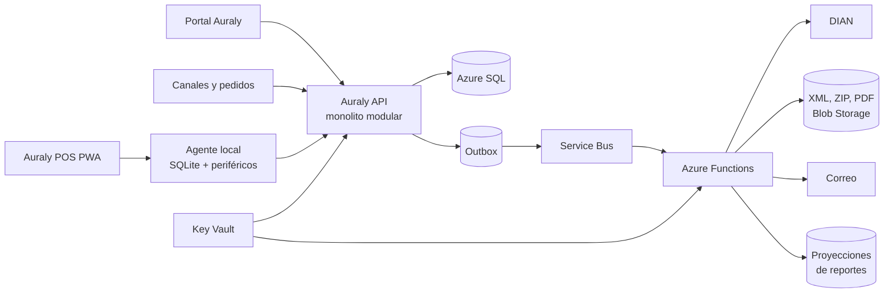
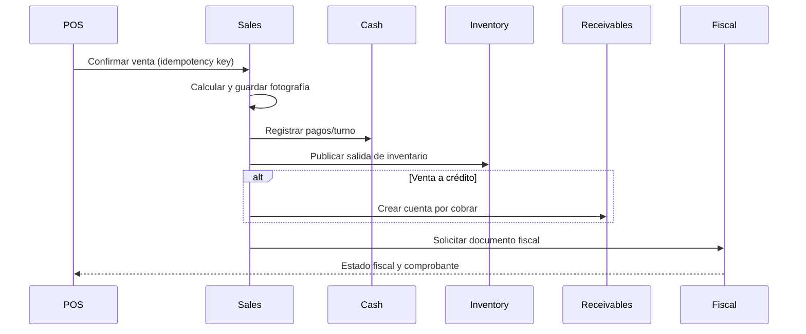
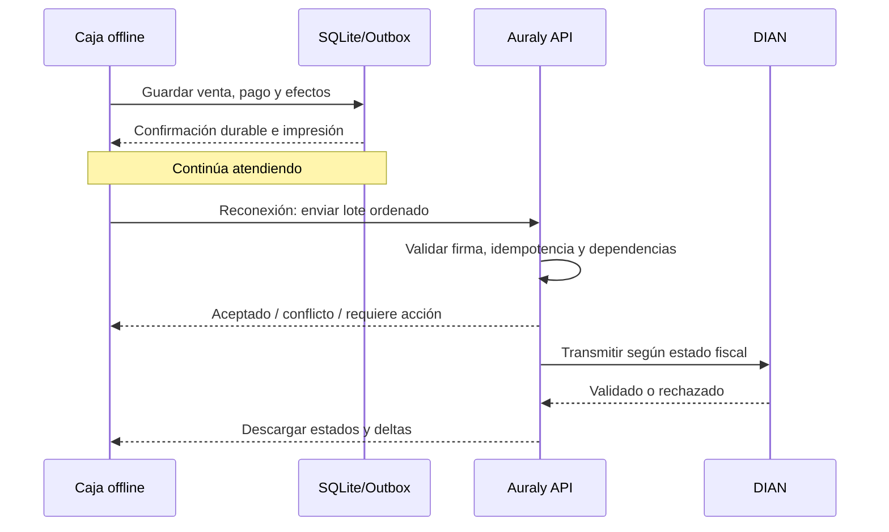

# Diseño de Auraly Commerce: ERP comercial mínimo

**Estado:** propuesta de arquitectura y alcance  
**Fecha:** 23 de julio de 2026  
**Fuentes analizadas:** Auraly, Xion, Pedidos OK y Xion Web  
**Decisión propuesta:** incorporar el núcleo comercial en Auraly como módulos de una misma plataforma, sin copiar el ERP anterior y sin crear por ahora otro producto independiente.

---

## 1. Decisión ejecutiva

Sí es viable absorber el conocimiento de Xion, Pedidos OK y Xion Web y convertirlo en un producto moderno dentro de Auraly. Además, hacerlo tiene una ventaja competitiva real: Auraly dejaría de ser solamente un canal conversacional que toma pedidos y podría cerrar el ciclo completo desde el pedido hasta la venta, la factura electrónica, el inventario, la cartera y los reportes.

La recomendación concreta es:

1. Construir **Auraly Commerce** como un conjunto de módulos dentro del backend y el portal actuales de Auraly.
2. Mantener fronteras internas claras para que, si en el futuro se necesita separar un módulo, pueda hacerse sin reescribir el negocio.
3. Implementar primero un **monolito modular**, no microservicios independientes ni una segunda aplicación web.
4. Crear facturación electrónica de desarrollo propio conectada directamente con la DIAN. FacturaTech quedaría, como máximo, como un adaptador opcional futuro y no como dependencia del MVP.
5. Incluir en el MVP comercial inventario, entradas de mercancía, cuentas por pagar, ventas, cuentas por cobrar, cajas, facturación electrónica, traslados, inventarios físicos, averías y reportes mínimos.
6. Tratar la operación offline de caja como una capacidad arquitectónica de primera clase. Para que sea realmente confiable, se recomienda una PWA acompañada de un agente local ligero para Windows, no depender exclusivamente del navegador.

No recomiendo hacer una plataforma separada ahora. Separarla duplicaría autenticación, organizaciones, productos, clientes, permisos, despliegues, soporte e integraciones. También obligaría a sincronizar dos fuentes que Auraly necesita consultar en tiempo real. La separación lógica mediante módulos ofrece el beneficio arquitectónico sin el costo operativo de dos productos.

La advertencia importante es que este alcance ya no corresponde a un MVP de “solo facturar”. Es un **MVP de operación comercial**. Puede salir rápido si se controla cuidadosamente lo que queda fuera, pero no sería responsable prometerlo completo en pocas semanas.

---

## 2. Qué se reutiliza realmente de los sistemas anteriores

No se debe migrar código de manera mecánica. El activo principal de los tres proyectos es el conocimiento codificado: entidades, estados, reglas, casos límite, flujos operativos, fórmulas, documentos y experiencia de uso.

### 2.1 Xion

Xion contiene la mayor parte del dominio operativo:

- productos con una ficha mucho más rica que la actual de Auraly;
- códigos alternos y de barras;
- existencias por bodega;
- precios, costos, impuestos y proveedores;
- entradas y salidas de mercancía;
- traslados;
- inventarios, conteos, reconteos y ajustes;
- averías, lotes y seriales;
- kardex y costo promedio;
- ventas, pagos, caja y cartera;
- cuentas por pagar;
- resoluciones, folios y facturación electrónica;
- procesamiento local y posterior sincronización.

`MotorService` y el esquema de movimientos por procesar muestran qué efectos necesita producir cada operación. Ese conocimiento sí debe conservarse. No se debe trasladar el sondeo cada 500 ms, las entidades duplicadas local/servidor, el uso de `double` para dinero, las rutas locales, las transacciones gigantes ni el acoplamiento de miles de líneas en un solo servicio.

El servicio directo con la DIAN es una fuente muy valiosa para:

- conocer el armado de XML UBL;
- identificar campos que ya fueron necesarios;
- recuperar ejemplos y vectores de prueba;
- entender CUFE, QR, firma XAdES, ZIP, envío SOAP y respuestas;
- enumerar notas crédito, contingencias y datos de resolución.

No debe desplegarse como está. La versión nueva debe usar reglas y anexos técnicos vigentes, `decimal` para valores monetarios, almacenamiento seguro, secretos en Key Vault, artefactos inmutables, pruebas automatizadas y adaptadores desacoplados.

### 2.2 Pedidos OK

Pedidos OK demuestra una operación offline-first:

- base SQLite local;
- catálogo descargable;
- registros pendientes de subir;
- separación entre servicios locales y remotos;
- consecutivos por dispositivo;
- sincronización de pedidos y sus detalles.

Se deben conservar los conceptos de outbox local, identificadores por dispositivo, sincronización incremental e idempotencia. No se deben portar Xamarin, PCL, Web Services antiguos ni la duplicación manual de servicios.

### 2.3 Xion Web

Xion Web aporta la lectura analítica del negocio:

- ventas por fechas, productos, bodegas y vendedores;
- compras y comparaciones por proveedor;
- temporadas y comisiones;
- exportaciones y reportes;
- filtros por categorías, empresa y centros operativos.

Se deben conservar definiciones, dimensiones, fórmulas y preguntas de negocio. No se deben migrar MVC 5, Crystal Reports, modelos EF generados ni pantallas completas.

### 2.4 Qué significa “absorber el conocimiento”

Para cada capacidad heredada se debe producir una matriz con estas columnas:

| Elemento anterior | Se usa hoy | Regla que representa | Destino en Auraly | Decisión |
|---|---:|---|---|---|
| Entidad o campo | Sí/No | Por qué existe | Módulo/entidad nueva | Adoptar, simplificar o descartar |
| Formulario | Sí/No | Flujo y atajos útiles | Caso de uso/grilla | Rediseñar |
| Reporte | Sí/No | Métrica y fórmula | Consulta/proyección | MVP o posterior |
| Servicio | Sí/No | Efectos e invariantes | Comando/evento | Reimplementar |
| Integración | Sí/No | Contrato externo | Adaptador | Rehacer o retirar |

Las bases de datos y el código anterior funcionan como una especificación ejecutable, no como la arquitectura de destino.

---

## 3. Alcance exacto del MVP comercial

### 3.1 Incluido

#### Configuración organizacional y fiscal

- organización o tenant;
- empresa o negocio operativo;
- sedes;
- bodegas;
- cajas y dispositivos;
- usuarios, roles y permisos;
- perfil fiscal por emisor;
- responsabilidades y tributos;
- ambientes de habilitación y producción;
- certificados;
- resoluciones, prefijos y rangos;
- rangos de contingencia;
- medios de pago;
- impuestos y unidades de medida.

#### Terceros

- clientes;
- proveedores;
- identificación y tipo de persona;
- contactos, direcciones y correo fiscal;
- responsabilidades tributarias;
- condiciones de crédito;
- cupo;
- listas de precio;
- estado activo/bloqueado.

Cliente y proveedor deben compartir un maestro de terceros. Una misma persona o empresa puede cumplir ambos roles.

#### Productos

- ficha integral;
- servicios y bienes inventariables;
- códigos internos, referencias y múltiples códigos de barras;
- unidades y conversiones;
- categorías;
- marcas o casas comerciales;
- impuestos de compra y venta;
- impuesto al consumo cuando aplique;
- precios y listas;
- costos;
- proveedor preferido;
- configuración por bodega;
- mínimos, máximos y ubicación;
- manejo de inventario, negativos, lotes, seriales y vencimiento;
- imágenes;
- importación inicial por archivo;
- búsqueda rápida y por escáner.

#### Inventario

- saldos por producto y bodega;
- libro inmutable de movimientos o kardex;
- saldos iniciales;
- entradas de mercancía;
- traslados entre bodegas;
- inventario físico, conteo, reconteo y ajuste;
- averías;
- devoluciones de venta y compra mínimas;
- consulta de existencias y movimientos;
- costo promedio;
- reserva de inventario para pedidos confirmados, configurable.

#### Compras y cuentas por pagar

- registro de factura o documento del proveedor;
- entrada de mercancía asociada;
- compras de contado o crédito;
- fecha de vencimiento;
- una o varias cuotas;
- obligación por pagar;
- pagos y aplicaciones;
- notas/ajustes mínimos;
- saldo y antigüedad.

Una recepción física y una factura del proveedor son conceptos relacionados, pero diferentes. El MVP permitirá registrarlos juntos por rapidez y también separarlos cuando la mercancía llegue antes que la factura.

#### Ventas, POS y caja

- apertura y cierre de turno;
- venta por lectura de código de barras;
- búsqueda manual;
- venta de contado o crédito;
- pagos combinados;
- suspensión y recuperación de una venta;
- descuentos con permiso;
- devolución y nota crédito;
- arqueo y diferencias;
- impresión de comprobante;
- conversión de pedidos de Auraly a venta;
- operación online y offline.

#### Cuentas por cobrar

- creación desde una venta a crédito;
- vencimientos o cuotas;
- abonos;
- aplicación de pagos;
- ajustes básicos;
- saldo;
- estado;
- antigüedad de cartera;
- bloqueo por mora o cupo, configurable.

#### Facturación electrónica directa

- factura electrónica de venta;
- nota crédito;
- nota débito solamente si un caso real del primer cliente la requiere; el motor quedará preparado;
- XML UBL;
- CUFE/CUDE según el documento;
- firma XAdES;
- QR;
- empaquetado;
- envío directo;
- interpretación de respuesta;
- PDF de representación gráfica;
- entrega por correo;
- reintentos;
- conciliación;
- contingencia;
- trazabilidad completa.

#### Reportes mínimos

- ventas;
- compras;
- costo de venta;
- utilidad bruta;
- inventario y valorización;
- kardex;
- averías;
- cuentas por cobrar;
- cuentas por pagar;
- cierre de caja;
- documentos electrónicos y estados DIAN.

Todos deben soportar rangos de fechas y filtros por organización, empresa/negocio, sede y bodega cuando corresponda.

### 3.2 Fuera del MVP

Quedan explícitamente aplazados:

- contabilidad general y plan contable completo;
- nómina;
- producción y transformación;
- manufactura;
- importaciones;
- compras con aprobación multinivel;
- licitaciones y cotizaciones complejas;
- retenciones y escenarios tributarios poco frecuentes que no use el piloto;
- intereses de financiación y cobranza jurídica avanzada;
- comisiones complejas;
- fidelización;
- comercio electrónico;
- rutas logísticas;
- inteligencia de negocios avanzada;
- migración histórica total;
- reproducción exacta de todos los reportes de Xion;
- soporte completo para cualquier industria desde el primer lanzamiento.

Lotes, seriales, vencimientos y códigos de balanza deben existir como capacidades configurables del modelo. Solo se completa toda su interfaz en el MVP si el negocio piloto realmente los utiliza.

---

## 4. Lo que faltaba considerar en un “MVP de factura”

La venta no empieza en el botón Facturar. Para que el producto funcione en una caja real, hacen falta estas piezas:

1. **Apertura y cierre de caja:** base inicial, ingresos, egresos, retiros, arqueo y diferencias.
2. **Numeración y fiscalidad por emisor:** una empresa puede tener varias sedes, prefijos, cajas y resoluciones.
3. **Devoluciones:** una venta validada no se edita ni se elimina; se corrige con devolución y nota crédito.
4. **Pagos mixtos:** efectivo, tarjeta, transferencia, crédito y combinaciones.
5. **Ventas suspendidas:** el cajero debe poder estacionar una venta sin perder la fila.
6. **Precios e impuestos como fotografía:** una venta histórica no debe cambiar si luego se edita el producto.
7. **Redondeo:** la regla debe ser única, determinista y probada en cliente, servidor, PDF y XML.
8. **Costo de venta:** sin costo fiable, el reporte de utilidad es engañoso.
9. **Saldos iniciales:** se necesita una forma auditada de comenzar inventario, cartera y cuentas por pagar.
10. **Importación:** cargar productos, códigos, precios, existencias y terceros manualmente haría inviable la adopción.
11. **Permisos:** cambiar precio, vender con inventario negativo, anular, reabrir caja y ajustar inventario requieren autorización.
12. **Auditoría:** toda acción sensible debe conservar usuario, dispositivo, fecha, motivo y antes/después.
13. **Impresión y periféricos:** impresora térmica, lector, cajón monedero y, cuando aplique, balanza.
14. **Cliente consumidor final:** reglas de identificación, correo y datos fiscales sin frenar una fila.
15. **Observabilidad:** pendientes de sincronizar, documentos rechazados, certificados próximos a vencer y rangos por agotarse.
16. **Zonas horarias:** fecha comercial local y marca de tiempo UTC deben coexistir.
17. **Concurrencia:** dos cajas pueden vender simultáneamente el último producto.
18. **Idempotencia:** reintentar un clic, una petición o una sincronización nunca debe duplicar venta, pago, inventario o factura.

Estas piezas no son adornos de un ERP grande; son condiciones para que el MVP no falle en la operación diaria.

---

## 5. Arquitectura propuesta

### 5.1 Estilo

Auraly Commerce se implementará como un **monolito modular** sobre la solución .NET 8 existente:

- una API desplegable;
- una base Azure SQL compartida, con esquemas o fronteras de tablas claras;
- transacciones locales fuertes;
- eventos de dominio y outbox;
- Azure Functions para trabajo asíncrono;
- Service Bus para colas;
- Blob Storage para artefactos;
- Key Vault para certificados y secretos;
- portal Next.js para administración;
- aplicación POS instalable;
- agente local opcional/obligatorio para el modo offline robusto de Windows.

No se recomienda extraer microservicios en el MVP. Inventario, venta, caja, cartera y numeración necesitan consistencia transaccional y evolucionarán juntos. Separarlos prematuramente aumentaría fallos distribuidos y tiempo de entrega.

### 5.2 Módulos

| Módulo | Responsabilidad |
|---|---|
| Organizations | tenants, empresas, sedes, configuración y permisos |
| Parties | clientes, proveedores, contactos y datos fiscales |
| Catalog | productos, códigos, unidades, categorías y configuración por bodega |
| Pricing & Tax | listas, precios, descuentos, impuestos y cálculo |
| Inventory | bodegas, saldos, libro de movimientos, conteos, traslados y averías |
| Purchasing | documentos de proveedor y recepciones |
| Payables | obligaciones, vencimientos, pagos y aplicaciones |
| Sales & POS | pedidos convertidos, ventas, devoluciones y pagos |
| Cash | cajas, turnos, arqueos, ingresos y egresos |
| Receivables | cartera, cuotas, abonos y aplicaciones |
| Fiscal | numeración, XML, firma, DIAN, contingencia y entrega |
| Offline Sync | dispositivos, outbox, sincronización, conflictos y estado |
| Reporting | proyecciones y consultas operativas |
| Audit | trazabilidad transversal |

### 5.3 Regla de integración interna

Los módulos se comunican mediante comandos, eventos y contratos, no accediendo arbitrariamente a las tablas de otro módulo.

Ejemplo de una venta:

La confirmación inicial debe registrar venta, pago, movimiento lógico y outbox en una sola transacción. La comunicación externa con la DIAN ocurre después y nunca mantiene una transacción de base de datos abierta.

---

## 6. Modelo de datos propuesto

Los nombres son de diseño y pueden ajustarse al estándar actual de Auraly. Todas las tablas operativas deben incluir `TenantId`; las que correspondan también `BusinessId`, `BranchId` y datos de auditoría.

### 6.1 Organización y fiscalidad

- `Businesses`: entidad comercial dentro del tenant.
- `Branches`: sedes o establecimientos.
- `FiscalProfiles`: NIT, razón social, responsabilidades, tributos, dirección y ambiente.
- `FiscalCertificates`: referencia segura, vigencia, huella y estado; nunca la clave en texto.
- `FiscalNumberingRanges`: tipo, prefijo, desde, hasta, siguiente, vigencia, resolución, clave técnica y estado.
- `FiscalDeviceAllocations`: bloques reservados a dispositivos offline.
- `Warehouses`: bodega, sede, tipo y estado.
- `CashRegisters`: caja, sede, bodega asociada y dispositivo.
- `Devices`: identidad, clave pública, estado y última sincronización.

No se debe usar un contador calculado con `MAX(numero) + 1`. La asignación debe ser atómica, auditable y sin superposición.

### 6.2 Terceros

- `Parties`
- `PartyRoles`
- `PartyIdentifications`
- `PartyAddresses`
- `PartyContacts`
- `PartyTaxResponsibilities`
- `CustomerProfiles`
- `SupplierProfiles`

El documento comercial conserva una fotografía de nombre, identificación, dirección y responsabilidades. No depende de que el tercero siga igual en el futuro.

### 6.3 Producto

#### `Products`

Campos mínimos:

- identificador;
- código interno/SKU;
- referencia;
- nombre;
- descripción corta y larga;
- tipo: producto, servicio o paquete;
- unidad base;
- marca/casa comercial;
- categoría y subcategoría;
- perfil tributario de compra;
- perfil tributario de venta;
- impuesto al consumo;
- inventariable;
- permite inventario negativo;
- maneja lote;
- maneja serial;
- maneja vencimiento;
- código de balanza;
- peso, volumen y empaque;
- costo actual y método de costo;
- activo;
- fechas y auditoría.

#### Tablas relacionadas

- `ProductBarcodes`: múltiples códigos, unidad, factor de conversión, principal, tipo y vigencia.
- `ProductUnits`: compra, venta, empaque y equivalencia con unidad base.
- `ProductWarehouseSettings`: activo, ubicación, mínimo, máximo, punto de reorden y venta negativa por bodega.
- `ProductSuppliers`: código del proveedor, costo, plazo, mínimo y preferencia.
- `PriceLists`
- `ProductPrices`
- `ProductImages`
- `ProductTaxProfiles`
- `ProductAliases`: mantiene la capacidad conversacional de Auraly sin confundir alias con código de barras.

Restricciones:

- un código de barras activo debe ser único dentro del tenant, salvo excepción explícita;
- cantidades usan `decimal`, nunca `double`;
- dinero usa `decimal` con precisión definida;
- precio, impuesto, costo y descripción se copian a cada línea documental como fotografía;
- eliminar un producto usado históricamente no está permitido; se desactiva.

### 6.4 Inventario

- `InventoryTransactions`: cabecera común con tipo, documento origen, bodega, fecha efectiva, fecha de registro, usuario y dispositivo.
- `InventoryTransactionLines`: producto, lote/serial, entrada, salida, costo unitario, costo promedio anterior/nuevo y referencia.
- `InventoryBalances`: saldo materializado por producto, bodega y dimensión de lote cuando aplique.
- `StockReservations`: origen, cantidad, vencimiento y estado.
- `GoodsReceipts` / `GoodsReceiptLines`
- `WarehouseTransfers` / `WarehouseTransferLines`
- `StockCounts` / `StockCountLines`
- `DamageReports` / `DamageReportLines`
- `InventoryAdjustments`

`InventoryBalances` acelera consultas, pero `InventoryTransactionLines` es la fuente auditable. Un saldo no se corrige editándolo: se registra un movimiento compensatorio.

Cada movimiento guarda dos fechas:

- `OccurredAt`: cuándo ocurrió comercialmente;
- `RecordedAt`: cuándo llegó al servidor.

Esto es indispensable para ventas offline.

### 6.5 Compras y cuentas por pagar

- `SupplierDocuments`: factura o documento del proveedor, fechas, impuestos, descuentos, total y estado.
- `SupplierDocumentLines`: fotografía de producto, cantidades, costo e impuestos.
- `SupplierDocumentReceipts`: relación muchos-a-muchos con entradas.
- `Payables`: obligación originada por documento.
- `PayableInstallments`: vencimientos.
- `PayableEntries`: débitos, créditos, ajustes y pagos.
- `SupplierPayments`
- `SupplierPaymentApplications`

El saldo se deriva del libro de cartera y sus aplicaciones. Puede materializarse para consulta, pero no debe existir únicamente como un número mutable.

Flujo mínimo de entrada:

1. seleccionar proveedor, bodega y datos del documento;
2. escanear o buscar productos;
3. registrar cantidades, costo, descuentos e impuestos;
4. confirmar recepción;
5. crear movimiento de entrada;
6. actualizar costo promedio;
7. si es crédito, crear obligación y vencimientos;
8. si es contado, registrar pago;
9. conservar relación entre recepción, documento y obligación.

### 6.6 Ventas, caja y cuentas por cobrar

- `CashSessions`
- `CashMovements`
- `Sales`
- `SaleLines`
- `SalePayments`
- `SuspendedSales`
- `SalesReturns`
- `SalesReturnLines`
- `Receivables`
- `ReceivableInstallments`
- `ReceivableEntries`
- `CustomerReceipts`
- `CustomerReceiptApplications`

La venta conserva:

- identidad de cliente;
- vendedor y cajero;
- caja, sede y bodega;
- origen: POS, pedido, bot o importación;
- cantidades y unidades;
- precios y descuentos;
- impuestos por línea;
- subtotal, impuestos, redondeo y total;
- costos por línea;
- pagos;
- condición de crédito;
- fecha comercial y técnica;
- dispositivo e identificador local;
- estado comercial, de inventario, de pago, de sincronización y fiscal.

No se debe comprimir todo en un único campo `Estado`.

### 6.7 Documento fiscal

- `FiscalDocuments`
- `FiscalDocumentLines`
- `FiscalReferences`
- `FiscalArtifacts`
- `FiscalSubmissions`
- `FiscalEvents`
- `FiscalDeliveries`

La venta y la factura fiscal no son la misma entidad. Una venta puede existir mientras su documento está pendiente, en contingencia o rechazado. Esta separación también permite notas y eventos sin deformar la venta.

Estados sugeridos:

`Draft -> NumberAllocated -> Generated -> Signed -> Submitted -> Validated -> Delivered`

Ramas:

- `Rejected`
- `Contingency`
- `PendingTransmission`
- `TransmissionFailed`
- `CancelledByCreditNote`

Cada intento conserva solicitud, respuesta, código, mensaje y fecha. XML firmado, respuesta, ZIP y PDF son artefactos inmutables versionados.

---

## 7. Grilla operativa y experiencia con lector

La velocidad de la caja no es un detalle visual. Debe ser un componente de producto con criterios de rendimiento y comportamiento explícitos.

### 7.1 Componente común

Se construirá un `ProductEntryGrid` reutilizable por:

- venta/POS;
- entrada de mercancía;
- inventario físico;
- traslado;
- avería;
- devolución;
- ajuste.

Cada módulo configura columnas, permisos y cálculo, pero no reimplementa la captura.

| Módulo | Columnas principales |
|---|---|
| POS | código, producto, cantidad, unidad, precio, descuento, impuesto, total, existencia |
| Entrada | código, producto, cantidad, unidad, costo, descuentos, impuesto, lote/vencimiento, total |
| Inventario | código, producto, esperado, contado, reconteo, diferencia |
| Traslado | código, producto, disponible, cantidad enviada, recibida y diferencia |
| Avería | código, producto, disponible, cantidad averiada, motivo, costo e impacto |
| Devolución | código, producto, vendido, devuelto, motivo y total |

### 7.2 Flujo de escaneo

El lector USB común opera como teclado:

1. la grilla mantiene un receptor de escaneo enfocado;
2. el lector escribe el código y envía Enter;
3. se resuelve localmente el código;
4. el producto se agrega o incrementa;
5. se recalcula;
6. se muestra confirmación visual y sonora;
7. el foco vuelve al receptor sin hacer clic;
8. queda preparado para el siguiente producto.

Objetivo: confirmación visual en menos de 100 ms cuando el producto está en el catálogo local.

Reglas:

- un escaneo repetido incrementa cantidad por defecto;
- productos serializados abren captura de serial y no se agregan silenciosamente;
- códigos de empaque aplican su factor de conversión;
- códigos de balanza se interpretan según configuración;
- producto desconocido muestra una acción rápida, pero no rompe el foco de la fila;
- producto inactivo o no habilitado en la bodega produce error claro;
- inventario insuficiente aplica la política del negocio y permiso del usuario;
- no se confunde escritura humana lenta con una ráfaga del lector.

### 7.3 Teclado y edición

- Enter confirma celda y avanza;
- Tab y Shift+Tab recorren columnas editables;
- flechas navegan;
- F2 o atajo abre búsqueda;
- Supr elimina con confirmación según el caso;
- `+` y `-` ajustan cantidad;
- atajos de pago, cliente, suspender y confirmar;
- el foco no salta al inicio después de recalcular;
- columnas de solo lectura no reciben foco;
- cantidades aceptan decimales solo si la unidad lo permite;
- una grilla larga se virtualiza sin perder edición.

### 7.4 Recálculo

Cambiar cantidad, unidad, precio o descuento recalcula inmediatamente:

- bruto;
- descuentos;
- bases;
- impuestos;
- subtotal;
- redondeo;
- total de línea;
- totales del documento;
- costo y margen cuando el rol pueda verlos.

El cliente ofrece una vista previa instantánea. El servidor es la autoridad y vuelve a calcular antes de confirmar. Ambos motores ejecutan un conjunto común de vectores de prueba para evitar diferencias. Cada versión de las reglas de cálculo queda identificada.

Nunca se confía en totales enviados por el navegador. El servidor recibe entradas y produce el desglose definitivo.

### 7.5 Protección del trabajo

- borrador automático local;
- recuperación después de cerrar o recargar;
- aviso de venta pendiente;
- deshacer la última línea;
- confirmación antes de abandonar;
- bloqueo contra doble envío;
- indicador online/offline y cantidad pendiente de sincronizar siempre visible.

---

## 8. Facturación electrónica propia

### 8.1 Decisión

Auraly será un software de desarrollo propio. No necesita convertirse en proveedor tecnológico para facturar en nombre propio de cada cliente mediante el modo de operación correspondiente, pero cada facturador debe completar registro, habilitación, pruebas, certificado y numeración aplicables.

Según la información vigente consultada en la DIAN:

- se admite explícitamente software de desarrollo propio;
- debe configurarse el modo de operación;
- el software propio debe superar el set de pruebas;
- se requiere certificado de firma digital;
- se requieren rangos autorizados y asociación de prefijos;
- se deben prever rangos de contingencia;
- la factura y las notas se someten a validación previa, salvo los casos reglados de contingencia.

Fuentes oficiales de referencia:

- [Formas de facturar electrónicamente](https://micrositios.dian.gov.co/sistema-de-facturacion-electronica/como-puedes-facturar-electronicamente/)
- [Requerimientos y habilitación](https://micrositios.dian.gov.co/sistema-de-facturacion-electronica/requerimientos-para-ser-facturador-electronico/)
- [Pasos y numeración](https://micrositios.dian.gov.co/sistema-de-facturacion-electronica/preparate-pasos-para-ser-facturador-electronico/)
- [Inconvenientes tecnológicos](https://micrositios.dian.gov.co/sistema-de-facturacion-electronica/inconvenientes-tecnologicos/)
- [Anexo técnico de factura electrónica 1.9](https://www.dian.gov.co/impuestos/factura-electronica/Documents/Anexo-Tecnico-Factura-Electronica-de-Venta-vr-1-9.pdf)

Este documento es una decisión técnica, no asesoría tributaria. Antes de producción se debe validar el flujo de contingencia y los plazos contra la resolución y el anexo vigentes en la fecha de salida.

### 8.2 Componentes

1. `FiscalRuleSet`: catálogos, reglas y versión del anexo.
2. `DocumentBuilder`: modelo fiscal canónico a UBL.
3. `TaxCalculator`: bases, tributos, redondeos y totales.
4. `NumberAllocator`: resolución, prefijo, rango y asignación atómica.
5. `UniqueCodeGenerator`: CUFE/CUDE y QR.
6. `XadesSigner`: firma con certificado.
7. `ArtifactStore`: XML, ZIP, PDF y respuestas.
8. `DianTransport`: habilitación y producción.
9. `DianResponseParser`: estados y errores accionables.
10. `SubmissionOrchestrator`: envío, reintento y conciliación.
11. `GraphicalRepresentation`: PDF/impresión.
12. `DeliveryService`: correo y evidencia de entrega.
13. `CertificateMonitor`: vencimiento y rotación.
14. `NumberingMonitor`: vigencia y agotamiento.

El contrato con la DIAN queda detrás de una interfaz. Esto permite pruebas, cambios de versión y un adaptador de respaldo futuro sin contaminar ventas.

### 8.3 Seguridad

- certificado y contraseña nunca en configuración plana;
- claves del servidor en Key Vault;
- acceso mediante identidad administrada;
- auditoría de uso del certificado;
- rotación y alertas;
- XML firmado no editable;
- cifrado en tránsito y reposo;
- acceso a artefactos por URLs temporales;
- secretos de un tenant aislados de los demás.

Para una caja offline que firma localmente, la clave privada no debe quedar en IndexedDB. El agente local usa el almacén de certificados de Windows, DPAPI y, cuando exista, protección de hardware. El dispositivo se registra y puede revocarse.

### 8.4 Estrategia de pruebas

- validación XSD;
- reglas del anexo;
- vectores dorados recuperados y anonimizados de Xion;
- comparación de CUFE;
- pruebas de firma;
- factura con cada impuesto soportado;
- descuentos y cargos;
- consumidor final y cliente identificado;
- notas con referencias;
- rechazo y corrección;
- certificados vencidos o incorrectos;
- rangos agotados;
- reintentos y respuestas duplicadas;
- ambiente de habilitación;
- pruebas de contrato contra DIAN;
- generación de PDF consistente con XML.

La habilitación externa es una dependencia de calendario y no debe confundirse con terminar el código.

---

## 9. Venta offline y sincronización

### 9.1 Qué significa realmente offline

Hay tres estados distintos:

1. **Operación local:** la caja puede escanear, cobrar, imprimir y guardar sin internet.
2. **Sincronización comercial:** la venta, pago e inventario llegan al servidor central.
3. **Estado fiscal:** el documento fue generado, firmado y validado, o fue expedido bajo una contingencia permitida y está pendiente de transmisión.

La interfaz nunca debe mostrar “validada por DIAN” cuando solamente está guardada localmente.

La DIAN diferencia, entre otros, el inconveniente tecnológico del facturador y el atribuible a la DIAN. Su guía indica que el primero usa numeración de contingencia previamente solicitada y posterior transcripción/transmisión; cuando la indisponibilidad es de la DIAN, se genera y entrega sin validación previa y se transmite al restablecerse el servicio dentro del plazo aplicable. Por eso “se cayó el internet del local” no se modelará como una cola genérica sin trazabilidad fiscal.

### 9.2 Arquitectura recomendada

#### PWA

La interfaz POS web se instala como PWA y almacena:

- shell de aplicación;
- catálogo y códigos;
- precios e impuestos autorizados;
- clientes frecuentes;
- configuración de caja;
- borradores;
- indicadores de sincronización.

#### Auraly POS Edge

Un agente .NET 8 ligero para Windows aporta:

- SQLite cifrado;
- outbox duradero;
- conexión con impresora, cajón y otros periféricos;
- certificado local protegido;
- asignación de números reservados;
- generación/firma fiscal local cuando corresponda;
- copias de recuperación;
- sincronización en segundo plano;
- API local autenticada para la PWA.

Esto conserva la fortaleza conceptual del motor local de Xion, pero lo reduce a responsabilidades de borde. No contiene el ERP completo ni replica el servidor.

Una PWA pura podría cubrir un piloto con lector HID y operaciones pendientes, pero no es la recomendación para prometer continuidad offline, firma segura, impresión y recuperación en cajas Windows.

### 9.3 Datos locales

Cada registro local incluye:

- `TenantId`;
- `BusinessId`;
- `DeviceId`;
- `LocalOperationId` UUID;
- secuencia monotónica del dispositivo;
- fecha ocurrida local;
- fecha UTC;
- versión de catálogo/reglas;
- dependencia de otras operaciones;
- payload;
- hash;
- estado;
- intentos y último error.

El servidor aplica una restricción única sobre tenant, dispositivo y operación. Reenviar cien veces produce un solo efecto.

### 9.4 Sincronización

Orden:

1. autenticar dispositivo;
2. negociar checkpoint y versiones;
3. subir operaciones inmutables;
4. resolver dependencias;
5. confirmar cada operación;
6. descargar estados fiscales;
7. descargar deltas de catálogo, clientes y configuración;
8. limpiar solo elementos confirmados y respaldados.

### 9.5 Conflictos

No se usa “último cambio gana” para documentos financieros.

| Conflicto | Política |
|---|---|
| La misma venta llega dos veces | Idempotencia: una sola venta |
| Código de barra cambió | La línea conserva su fotografía; se alerta |
| Precio quedó viejo | Se acepta si la política offline y versión lo permiten; se marca |
| Cliente fue bloqueado | Se registra para revisión, sin borrar la venta cobrada |
| Existencia central se agotó | Se contabiliza la salida y se alerta saldo negativo/reconciliación |
| Número ya usado | Se bloquea el documento y se escala; bloques no se superponen |
| Certificado venció | No se afirma expedición válida; se activa procedimiento permitido |
| Operación depende de un cliente local | Se sube primero el tercero o se usa identidad temporal enlazable |

La disponibilidad de inventario global no puede garantizarse mientras varias cajas están desconectadas. Se reduce el riesgo asignando cada caja a una bodega, reservando stock por ubicación y definiendo si se permite quedar negativo.

### 9.6 Numeración offline

- el servidor reserva bloques no superpuestos por dispositivo y resolución;
- el dispositivo no inventa consecutivos fuera del bloque;
- cada asignación se audita;
- se monitorean vigencia, agotamiento y números no consumidos;
- un número consumido no se reutiliza silenciosamente;
- la revocación de una caja invalida futuras asignaciones;
- se mantiene numeración específica de contingencia cuando aplique.

Antes de habilitar producción se debe probar recuperación ante:

- pérdida del equipo;
- reinstalación;
- reloj incorrecto;
- venta simultánea;
- rango agotado;
- certificado vencido;
- internet intermitente;
- API disponible pero DIAN no;
- DIAN disponible pero local sin salida a internet;
- respuesta recibida por el servidor pero no por la caja.

### 9.7 Tablero operativo

El cajero y el administrador verán:

- conectado/desconectado;
- última sincronización;
- ventas pendientes;
- documentos pendientes de DIAN;
- rechazos;
- rango disponible;
- certificado y vigencia;
- espacio local;
- acción de reintento;
- exportación diagnóstica sin datos sensibles.

El soporte necesita poder explicar el estado exacto de una venta sin entrar a la base de datos.

---

## 10. Flujos principales

### 10.1 Crear producto

1. datos generales;
2. tipo y unidad base;
3. códigos de barras y empaques;
4. impuestos;
5. precios;
6. proveedor y costo;
7. bodegas, ubicación, mínimos y negativos;
8. lote/serial/vencimiento si aplica;
9. imagen;
10. validación y activación.

La pantalla debe mostrar pestañas o secciones progresivas. No se deben exponer cincuenta campos en una sola pared. El formulario ofrece valores por defecto por negocio e indica qué información es obligatoria para vender, comprar o facturar.

### 10.2 Entrada a crédito

1. proveedor y factura;
2. bodega y fechas;
3. escaneo de productos;
4. cantidades, costos, descuentos, impuestos y lotes;
5. conciliación de totales;
6. confirmar;
7. movimiento de entrada;
8. actualización de costo;
9. cuenta por pagar y vencimientos;
10. evento para reportes.

Si se recibe sin factura, se guarda una recepción pendiente de asociar. La obligación nace cuando exista el documento o la política contable definida, evitando inventar un número de factura.

### 10.3 Venta online

1. abrir caja;
2. escanear;
3. seleccionar cliente si se requiere;
4. elegir pagos;
5. validar crédito e inventario;
6. confirmar una sola vez;
7. guardar venta, pagos, salida y cartera;
8. asignar número;
9. generar, firmar y enviar;
10. imprimir/entregar;
11. mostrar estado fiscal.

La caja no queda congelada esperando indefinidamente una respuesta externa. Según la política fiscal y estado de red, muestra validada, pendiente o contingencia.

### 10.4 Venta offline

1. validar que caja, turno, catálogo, reglas, rango y certificado están aptos;
2. escanear y calcular localmente;
3. guardar transacción atómica en SQLite;
4. registrar pago y salida local;
5. generar el documento/soporte aplicable al escenario;
6. imprimir con estado correcto;
7. continuar atendiendo;
8. sincronizar al volver la red;
9. aplicar idempotentemente inventario, caja y cartera;
10. transmitir o conciliar documento;
11. descargar resultado;
12. alertar cualquier excepción.

### 10.5 Avería

1. bodega, tipo, motivo, responsable y proveedor opcional;
2. escaneo;
3. cantidad, lote/serial y observación;
4. confirmar;
5. salida o traslado a bodega de averías según configuración;
6. conservar costo e impacto;
7. permitir posterior devolución a proveedor, cambio o baja;
8. reportar valor y causa.

En el MVP se implementan registro, efecto de inventario y reporte. El flujo completo de reclamación/cambio con proveedor puede ser posterior.

### 10.6 Traslado

Estados:

`Draft -> Dispatched -> InTransit -> Received`

Para negocios pequeños se puede habilitar confirmación inmediata. Para sedes distintas se conservan cantidad despachada, recibida y diferencia. No se suma al destino antes de la recepción cuando se usa tránsito.

### 10.7 Devolución

Una devolución referencia líneas de la venta original, impide devolver más de lo vendido, revierte inventario según estado físico, ajusta pago o cartera y genera nota crédito cuando corresponda.

---

## 11. Reportes del MVP

### 11.1 Dimensiones comunes

- tenant;
- empresa/negocio;
- perfil fiscal;
- sede;
- bodega;
- caja;
- mes y rango de fechas;
- producto;
- categoría;
- cliente;
- proveedor;
- vendedor/cajero;
- medio de pago;
- estado comercial y fiscal.

### 11.2 Reportes

| Reporte | Métricas mínimas |
|---|---|
| Ventas | bruto, descuentos, neto, impuestos, devoluciones, unidades y ticket promedio |
| Compras | costo, descuentos, impuestos, unidades, proveedor y vencimientos |
| Utilidad | ventas netas, costo de venta, utilidad bruta y margen |
| Inventario | cantidad, costo promedio, valor, mínimos y negativos |
| Kardex | entradas, salidas, saldo, costo, documento y usuario |
| Averías | cantidades, costo, causa, producto, proveedor y bodega |
| CxC | saldo, vencido, por vencer, edades y cliente |
| CxP | saldo, vencido, por vencer, edades y proveedor |
| Caja | apertura, ventas, pagos, movimientos, esperado, contado y diferencia |
| Fiscal | generados, validados, rechazados, pendientes, contingencias y tiempos |

La utilidad del MVP será **utilidad bruta comercial**, no utilidad contable. Se calcula con el costo de venta registrado por línea. Debe nombrarse así para no inducir al cliente a pensar que incluye gastos, impuestos de renta u otros costos.

### 11.3 Implementación

Al inicio se usarán consultas bien indexadas y proyecciones simples. Cuando el volumen lo exija, eventos alimentarán tablas de lectura agregadas. No se requiere un data warehouse para el primer piloto.

Exportaciones iniciales:

- Excel/CSV para reportes;
- PDF para factura y cierre de caja;
- otros formatos solo por demanda validada.

---

## 12. Reglas técnicas no negociables

- `decimal` para dinero, cantidades y tasas.
- UTC para tiempo técnico y zona local para fecha comercial.
- documentos confirmados inmutables.
- correcciones por transacción compensatoria.
- identificadores UUID generados desde el origen para offline.
- claves de idempotencia en todos los comandos confirmables.
- control optimista de concurrencia.
- outbox transaccional en servidor.
- outbox durable en caja.
- auditoría por usuario y dispositivo.
- aislamiento por tenant en consulta, índices y almacenamiento.
- cálculos autoritativos en servidor.
- artefactos fiscales con hash.
- ninguna llamada externa dentro de una transacción SQL prolongada.
- ningún saldo financiero o de inventario sin un libro que lo explique.
- ninguna eliminación física de registros usados.
- pruebas automáticas de efectos contables/comerciales.
- permisos granulares.

### 12.1 Rendimiento objetivo

- resolver un código local: menos de 100 ms;
- agregar línea sin salto visible;
- abrir una venta nueva: menos de 1 segundo local;
- confirmar localmente una venta offline: menos de 2 segundos, excluyendo impresión;
- búsquedas administrativas comunes: menos de 2 segundos;
- sincronización por lotes y reanudable;
- una caída de Azure Function no bloquea la caja;
- una respuesta duplicada no duplica efectos.

---

## 13. Estrategia de implementación

### Fase 0 — Descubrimiento ejecutable (2 semanas)

- matriz de reutilización de Xion;
- inventario de tablas usadas y no usadas;
- selección de uno o dos negocios piloto;
- casos fiscales concretos;
- fórmulas doradas;
- datos anonimizados;
- mapa de Auraly actual;
- contratos de módulos;
- decisión final sobre lotes, seriales, balanza y retenciones.

Entregable: alcance congelado y backlog con criterios de aceptación.

### Fase 1 — Fundaciones y catálogo (2 a 3 semanas)

- módulos y esquemas;
- empresas, sedes, bodegas, cajas y permisos;
- terceros;
- ficha de producto;
- códigos y unidades;
- precios e impuestos;
- importadores;
- primera versión de `ProductEntryGrid`.

### Fase 2 — Inventario, entradas, averías y cuentas por pagar (3 a 4 semanas)

- libro de inventario;
- saldos y costos;
- entradas;
- documentos de proveedor;
- CxP;
- traslados;
- conteos;
- averías;
- consultas y reportes básicos.

### Fase 3 — POS, caja y cuentas por cobrar (3 a 4 semanas)

- venta rápida;
- pagos;
- turnos;
- pedidos a venta;
- CxC;
- devoluciones;
- impresión;
- reportes de venta, utilidad y caja.

### Fase 4 — Facturación electrónica directa (4 a 6 semanas)

- motor fiscal;
- XML, CUFE, firma y QR;
- comunicación DIAN;
- notas;
- PDF y correo;
- habilitación;
- estados y contingencia;
- observabilidad.

Parte de esta fase puede avanzar en paralelo con las fases 2 y 3 porque el contrato fiscal se prueba con documentos canónicos.

### Fase 5 — Offline robusto (4 a 6 semanas)

- PWA instalable;
- agente Edge;
- SQLite y outbox;
- periféricos;
- bloques de numeración;
- firma local;
- sincronización y conflictos;
- pruebas de desconexión y recuperación.

### Fase 6 — Piloto y endurecimiento (2 a 3 semanas)

- migración inicial;
- pruebas de volumen;
- seguridad;
- recuperación;
- capacitación;
- soporte;
- ajustes derivados de operación real.

### Estimación honesta

Para un equipo pequeño trabajando secuencialmente, el alcance comercial completo está aproximadamente en **16 a 22 semanas**, más cualquier espera externa de habilitación y decisiones tributarias.

Con dos o tres frentes experimentados trabajando en paralelo, contratos definidos y un piloto acotado, podría lograrse un piloto controlado en **10 a 14 semanas**. No es una promesa de fecha: primero se debe medir la reutilización real y congelar variantes.

Una salida comercial por etapas reduce riesgo:

- **MVP Online:** catálogo, inventario, entradas/CxP, POS/CxC, caja, averías, reportes y DIAN directa.
- **MVP Offline:** agrega agente local, numeración, firma, sincronización y recuperación endurecidas.

Si “vende siempre sin internet” será parte del mensaje comercial inicial, entonces el offline no puede quedar como parche posterior y debe estar en la definición de terminado.

---

## 14. Criterios de aceptación del MVP

### Producto

- un usuario crea un producto con varios códigos y lo habilita por bodega;
- un código escaneado encuentra el producto online y offline;
- precios, impuestos, unidades y empaques se aplican de forma consistente;
- se puede importar un catálogo inicial;
- no existen códigos activos duplicados no autorizados.

### Entrada y CxP

- una entrada incrementa inventario y kardex exactamente una vez;
- el costo queda trazable;
- una compra a crédito crea obligación y vencimiento;
- un pago reduce la obligación por aplicación;
- el reporte reproduce el saldo desde el libro.

### POS y CxC

- el cajero puede operar sin mouse durante la captura normal;
- cada lectura deja la grilla lista para la siguiente;
- editar cantidad recalcula línea y documento;
- una venta confirmada no se duplica al reintentar;
- una venta a crédito crea cartera;
- una devolución referencia y compensa la venta;
- cierre de caja explica el efectivo esperado.

### Inventario

- todo saldo se explica mediante movimientos;
- entradas, ventas, traslados, conteos y averías afectan la bodega correcta;
- no se edita el kardex;
- el costo de venta histórico no cambia al modificar el costo actual;
- diferencias offline quedan visibles.

### Facturación electrónica

- documentos de prueba superan habilitación;
- XML, firma, CUFE, QR y PDF son consistentes;
- cada intento y respuesta se auditan;
- un rechazo es comprensible y accionable;
- rangos y certificados generan alertas;
- una nota crédito corrige sin editar el original;
- el sistema no confunde guardado, enviado, validado y entregado.

### Offline

- la caja vende después de perder internet;
- reiniciar el equipo no pierde ventas confirmadas;
- la reconexión no duplica venta, pago, inventario ni factura;
- se ven pendientes y errores;
- conflictos nunca se resuelven silenciosamente;
- pérdida del dispositivo tiene un procedimiento probado;
- la numeración no colisiona entre cajas.

### Reportes

- ventas, compras, utilidad bruta, CxC y CxP concilian con documentos;
- el rango mensual respeta zona horaria;
- se filtra por empresa/negocio, sede y bodega;
- las devoluciones y averías se reflejan correctamente.

---

## 15. Riesgos y mitigaciones

| Riesgo | Impacto | Mitigación |
|---|---|---|
| Intentar migrar todo Xion | El proyecto nunca termina | Matriz de uso y exclusiones explícitas |
| Reglas fiscales antiguas | Rechazos o incumplimiento | Implementar contra norma vigente y habilitación |
| Certificado en navegador | Exposición de clave | Key Vault online y Edge seguro offline |
| Offline subestimado | Pérdida o duplicación | Outbox, SQLite, idempotencia y pruebas de caos |
| Inventario global desconectado | Saldos negativos | Bodega por caja, política y reconciliación |
| Fórmulas diferentes | Totales distintos | Vectores dorados y servidor autoritativo |
| Costo incorrecto | Utilidad engañosa | Libro de costos y fotografía por línea |
| Alcance tributario infinito | Retrasos | Casos reales del piloto y perfiles versionados |
| Una sola entidad gigante | Acoplamiento | Fronteras de módulo y fotografías documentales |
| Reportes sobre transacciones pesadas | Lentitud | Índices y proyecciones |
| Soporte sin visibilidad | Operación detenida | Tablero de sincronización/fiscal |
| Duplicar productos actuales | Inconsistencia con el bot | Evolucionar catálogo común, no crear otro |

---

## 16. Decisiones que deben cerrarse antes de construir

1. ¿Cuál es el primer tipo de negocio y qué impuestos usa realmente?
2. ¿Necesita lote, serial, vencimiento o balanza desde el piloto?
3. ¿Se permite inventario negativo?
4. ¿Costo promedio permanente será el único método inicial?
5. ¿La recepción puede existir sin factura del proveedor?
6. ¿Qué retenciones necesita el primer cliente?
7. ¿Cómo funciona su crédito: una fecha o varias cuotas?
8. ¿Qué impresoras, cajones y lectores deben certificarse?
9. ¿Cuántas cajas pueden quedar offline a la vez?
10. ¿Se exige factura electrónica en cada venta o hay documentos equivalentes dentro del alcance?
11. ¿Qué datos históricos deben importarse: saldos o movimientos completos?
12. ¿Qué nivel de aislamiento fiscal existe entre negocios de un tenant?

Estas decisiones no cambian la arquitectura general, pero sí el tamaño de las fases.

---

## 17. Recomendación final

La mejor decisión es **construir Auraly Commerce dentro de Auraly**, usando Xion, Pedidos OK y Xion Web como biblioteca de conocimiento y pruebas, no como código para copiar.

El núcleo debe diseñarse alrededor de cuatro ideas:

1. un catálogo rico y único que también alimente al agente conversacional;
2. un libro de movimientos que explique inventario, cartera y obligaciones;
3. una grilla operativa común optimizada para lector y teclado;
4. transacciones locales durables que puedan sincronizarse de manera idempotente.

La facturación electrónica propia sí es viable y estratégica. Reduce dependencia, mejora margen y permite controlar la experiencia completa, pero debe tratarse como un producto regulado: versión técnica, habilitación, seguridad, contingencias, monitoreo y mantenimiento continuo.

El offline también es viable y puede ser un diferenciador gigante. Su versión seria no consiste en guardar una petición fallida en el navegador; requiere identidad de dispositivo, base local durable, numeración reservada, certificado protegido, estados fiscales honestos, sincronización idempotente y manejo explícito de conflictos. El agente Edge es una inversión razonable porque aprovecha el aprendizaje de Xion sin regresar a un ERP WinForms.

La prioridad inmediata recomendada es ejecutar la Fase 0 y, con un negocio piloto concreto, convertir este documento en:

- mapa de entidades actuales y nuevas;
- matriz Xion → Auraly;
- contratos de los módulos;
- prototipo de la grilla;
- prueba técnica DIAN;
- prueba técnica POS Edge;
- backlog estimado por historias.

Con esa disciplina se puede ofrecer un producto integral sin volver a construir un ERP infinito.
