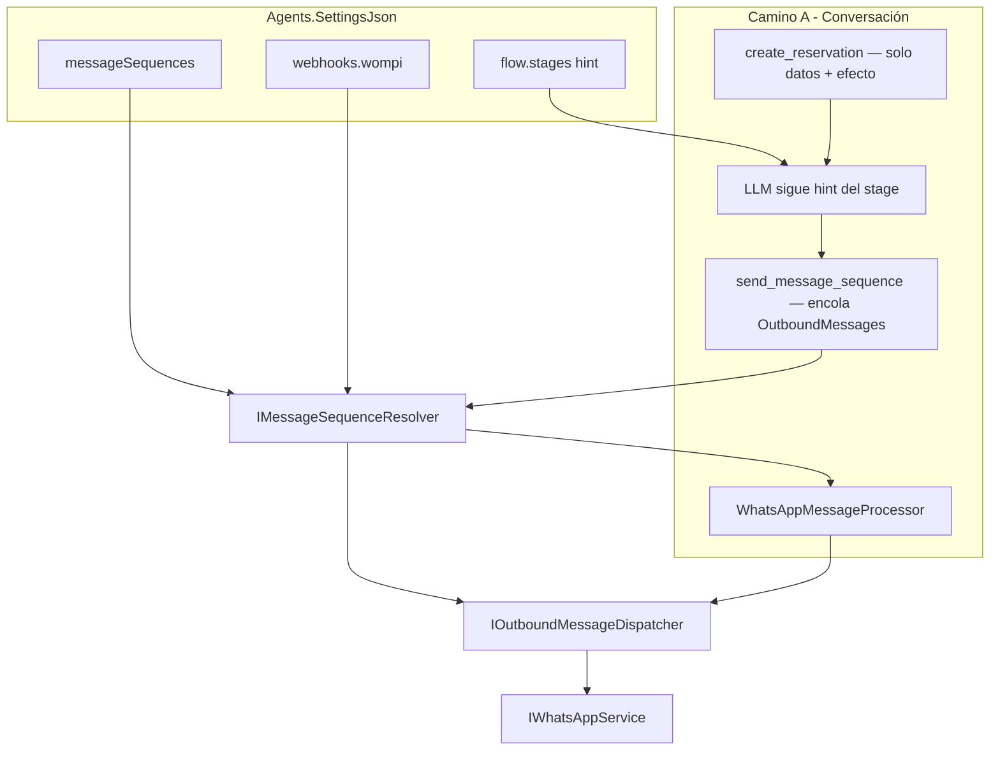

# Diseño: mensajes WhatsApp con adjuntos (secuencias outbound)

Documento de referencia del diseño implementado para enviar secuencias de WhatsApp (texto y adjuntos) de forma **genérica y multitenant**, configurable en `Agents.SettingsJson`.

---

## Objetivo

Ofrecer una **capacidad genérica** de enviar mensajes con adjuntos por WhatsApp. Cada tenant define catálogos nombrados (`messageSequences`); el agente conversacional los usa vía la tool `send_message_sequence`, y el webhook Wompi los dispara por outcome.

**Principio clave:** `create_reservation` solo crea la reserva y reporta datos (`reservation_id`, `date`, `time`, `status`). **No envía mensajes al cliente.** Quién confirma y cómo lo hace lo decide el tenant en el `hint` del stage + el catálogo de secuencias.

---

## Patrones multitenant (convención, no código)

| Patrón | Hint del stage | Secuencia | Resultado |
|--------|----------------|-----------|-----------|
| **C — secuencia confirma** (Mimi Bot) | "Tras reservar, llama `send_message_sequence('reservation_confirmed')`; no escribas tú la confirmación" | `reservation_confirmed` = confirmación + adjuntos | LLM puede cerrar breve o vacío; confirmación sale de la secuencia |
| **B — LLM confirma** (otro tenant) | "Tras reservar, confirma al cliente con fecha/hora; luego llama `send_message_sequence('reservation_docs')`" | `reservation_docs` = solo adjuntos | Confirmación natural del LLM en `Response`; adjuntos en OutboundMessages |

La confirmación debe vivir en **un solo lugar** por tenant (LLM **o** secuencia), nunca en ambos.

---

## Casos de uso actuales (Mimi Bot)

| Caso | Secuencia | Disparador |
|------|-----------|------------|
| Chat post-reserva | `reservation_confirmed` | Tool `send_message_sequence` tras `create_reservation` / `assign_paid_slot` |
| Webhook: reserva creada | `reservation_confirmed` | `webhooks.wompi.reservation_created` |
| Webhook: slot tomado tras pago | `payment_slot_taken` | `webhooks.wompi.slot_unavailable_after_payment` |

Secuencia auxiliar `reservation_docs` (solo adjuntos) queda disponible para tenants con patrón B.

---

## Arquitectura

| Componente | Responsabilidad |
|------------|-----------------|
| `create_reservation` / `assign_paid_slot` | Crear reserva + efecto `reservation_created`. Sin mensajes al cliente. |
| `send_message_sequence` | Resuelve secuencia nombrada y **encola** (no envía a mitad del loop). |
| `AgentTurnResult.OutboundMessages` | Mensajes tras `Response`, en orden. |
| `IMessageSequenceResolver` | Placeholders + SAS. No envía WhatsApp. |
| `IOutboundMessageDispatcher` | Envío WhatsApp (chat y webhook). |

---

## Camino A: flujo conversacional

1. LLM llama `create_reservation` → reserva creada, tool devuelve `date`, `time`, `status`.
2. Según el **hint** del stage: el LLM llama `send_message_sequence('reservation_confirmed')` (Mimi) o confirma en texto y llama `reservation_docs` (patrón B).
3. Processor envía `Response` (si el LLM escribió algo) y luego `OutboundMessages`.

---

## Legacy eliminado

- Plantilla `AgentToolTemplates.ReservationCreated` y fragmento `Exclusive` en `create_reservation`.
- `PaymentConfirmationNotifier` + `BusinessConfiguration` Key=1.

El efecto `ToolSideEffectNames.ReservationCreated` se mantiene (lead, métricas).

---

*Última actualización: tools de reserva sin mensajes; confirmación gobernada por hint + messageSequences.*
