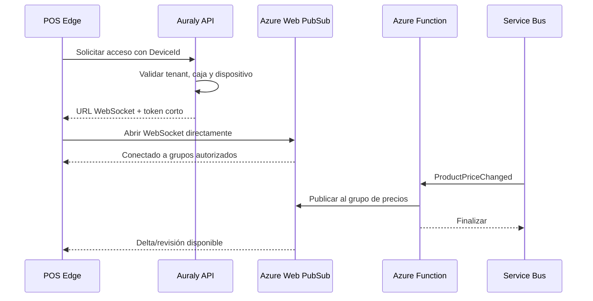

# Flujo de conexión entre POS Edge y Azure Web PubSub

**Estado:** aclaración técnica del diseño push  
**Fecha:** 23 de julio de 2026

## 1. La caja no se conecta a una Function

Arquitectura incorrecta:

```text
Caja -> HTTP Function esperando permanentemente
```

Una Function HTTP no debe mantener conexiones WebSocket de las cajas.

Arquitectura correcta:

```text
Caja -> Azure Web PubSub
```

Azure Web PubSub mantiene las conexiones persistentes.

La API y las Functions solamente:

- autentican;
- entregan token;
- publican eventos;
- procesan sincronización;
- terminan su ejecución.

---

## 2. Flujo de conexión



La conexión larga existe entre Edge y Web PubSub, no entre Edge y Function.

---

## 3. Responsabilidad de cada componente

### POS Edge

- solicita token;
- abre una conexión;
- recibe mensajes;
- aplica deltas;
- guarda checkpoints;
- reconecta.

### API de Auraly

- autentica dispositivo;
- valida tenant y caja;
- determina grupos;
- entrega token de corta duración;
- revoca acceso.

### Azure Web PubSub

- mantiene sockets;
- realiza heartbeats;
- administra conexiones;
- distribuye mensajes;
- publica por grupos;
- desconecta dispositivos revocados.

### Azure Function

- se activa por evento;
- agrupa cambios;
- construye delta;
- publica un mensaje;
- termina.

### Service Bus

- transporta eventos internos;
- no tiene una suscripción por caja.

---

## 4. Qué consume recursos

### Conexiones

```text
conexiones concurrentes ≈ cajas activas conectadas
```

Se dimensionan en Web PubSub.

### Functions

```text
ejecuciones ≈ cambios procesados y publicaciones
```

Una caja conectada sin mensajes no mantiene una Function ejecutándose.

### Mensajes

```text
mensajes entregados =
    publicaciones × conexiones afectadas
```

Por eso los grupos deben ser específicos y no enviar cada cambio a todas las cajas de todos los tenants.

---

## 5. Ejemplo

Escenario:

- 10.000 cajas conectadas;
- un negocio tiene 20 cajas;
- cambia un precio de ese negocio.

El backend:

1. procesa un evento;
2. ejecuta una Function corta;
3. publica una vez al grupo del negocio/lista;
4. Web PubSub entrega a 20 cajas.

Las otras 9.980 cajas no reciben el evento.

No hay:

- 10.000 ejecuciones de Function;
- 10.000 consultas SQL;
- una Function abierta por caja.

Sí existen 10.000 conexiones administradas por Web PubSub.

---

## 6. Activación de la conexión

Para controlar conexiones:

### Caja con turno abierto

- permanece conectada.

### Caja sin turno

- puede desconectarse después de un tiempo;
- se conecta al abrir turno;
- recupera deltas por checkpoint.

### Caja revocada

- se desconecta;
- no puede obtener token nuevo.

### Sin internet

- vende con catálogo local;
- intenta reconectar con backoff;
- recupera cambios faltantes.

---

## 7. Token

El token:

- identifica dispositivo;
- tiene vencimiento corto;
- autoriza grupos concretos;
- no concede acceso a otros negocios;
- se renueva sin reaprovisionar la caja.

Grupos:

```text
business:{businessId}
price-list:{priceListId}
cash-register:{cashRegisterId}
device:{deviceId}
```

La caja no puede elegir libremente un grupo.

---

## 8. Publicación

La Function no recorre todas las cajas.

Publica:

```text
SendToGroup(price-list:123, message)
```

Web PubSub mantiene el mapa de conexiones y realiza el fan-out.

---

## 9. Mensajes de conexión

No es necesario enviar al backend:

- cada heartbeat;
- cada segundo conectado;
- cada interacción del cajero.

Web PubSub maneja el canal.

Auraly registra solamente:

- conexión/desconexión relevante;
- revisión aplicada;
- error;
- última actividad;
- checkpoint.

Esto evita ruido y ejecuciones innecesarias.

---

## 10. Recepción de cambios

Mensaje:

```json
{
  "type": "PricingDeltaAvailable",
  "scope": "price-list:123",
  "fromRevision": 932,
  "toRevision": 933,
  "bundleId": "pricing-933"
}
```

Edge:

1. valida revisión;
2. descarga delta si no viene inline;
3. aplica SQLite;
4. guarda revisión;
5. reporta checkpoint de forma agrupada.

No confirma cada paquete mediante una Function dedicada.

---

## 11. Si Web PubSub no está disponible

- la caja sigue operando localmente;
- no se pierde catálogo existente;
- ventas permanecen en outbox;
- al reconectar compara checkpoint;
- descarga deltas faltantes;
- puede usar manifiesto como fallback.

Push mejora inmediatez, pero no es la única garantía.

---

## 12. Alternativa sin conexiones persistentes

Si el costo medido de Web PubSub no se justifica:

```text
Blob/Front Door + manifiesto ETag
```

La arquitectura de:

- revisiones;
- deltas;
- checkpoints;
- paquetes;

permanece igual.

Solo cambia cómo la caja se entera de que hay una revisión nueva.

Esto permite decidir mediante una prueba de costo sin rehacer sincronización.

---

## 13. Prueba de capacidad

Antes de producción se medirá:

- cajas activas promedio;
- máximo concurrente;
- mensajes por cambio;
- cambios diarios;
- reconexiones;
- bytes;
- costo de Web PubSub;
- costo del fallback por manifiesto;
- latencia de propagación.

La decisión comercial puede compararse:

```text
costo por caja conectada
vs.
tiempo máximo aceptable para propagar precios
```

---

## 14. Conclusión

Sí, cada caja abre una conexión.

Pero:

```text
no abre una Function
no abre un hilo en la API
no abre una conexión a SQL
```

Abre una conexión saliente a un servicio diseñado para administrar sockets.

Las Functions solo trabajan cuando existe un cambio real.
